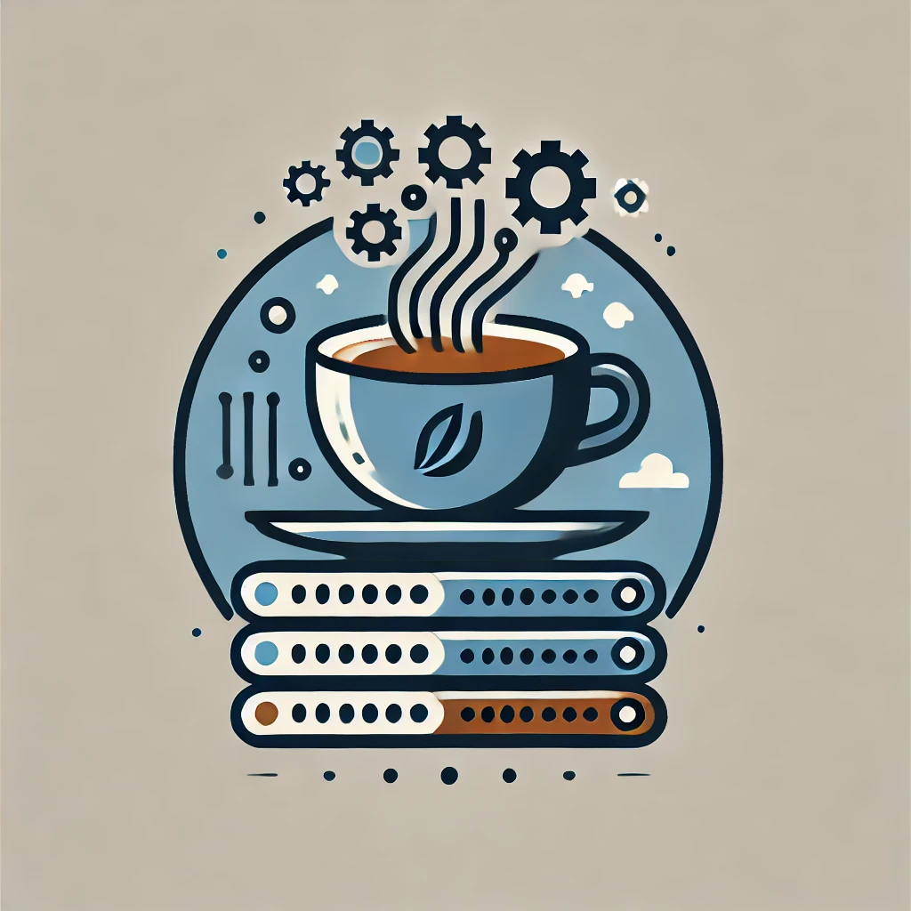
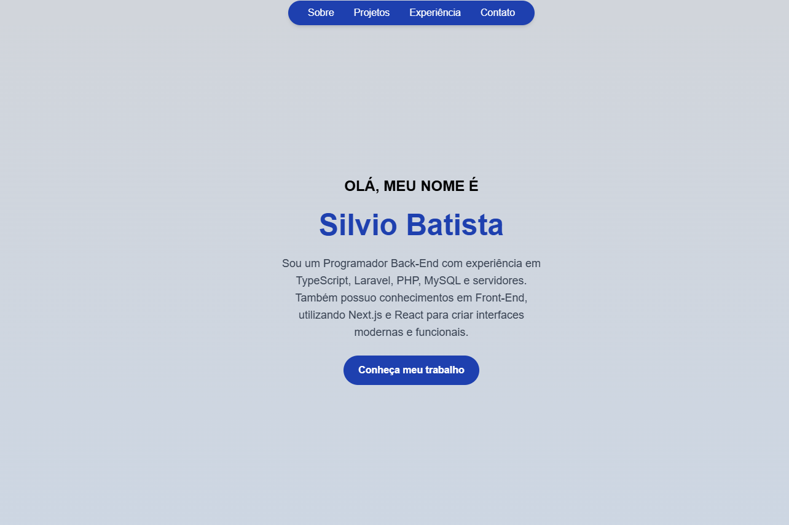
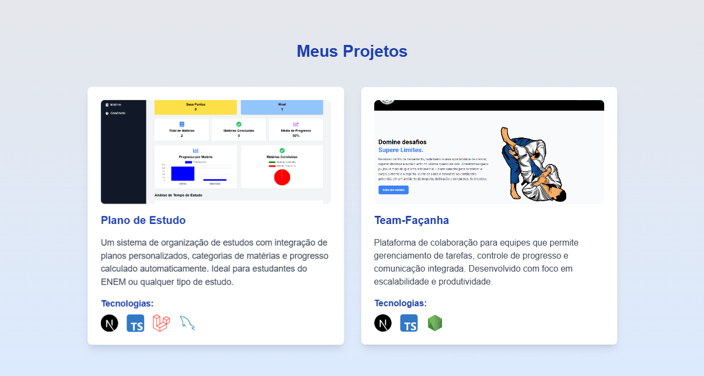

# 💼 Meu Portfólio Pessoal

Seja bem-vindo ao meu portfólio pessoal! 🚀 Aqui você encontrará mais sobre minha trajetória profissional, projetos, experiências e formas de entrar em contato comigo. Este é um projeto feito com **React**, **Next.js**, e utiliza um design moderno e responsivo.



---

## 🌟 Funcionalidades

- **Apresentação Pessoal**: Introdução elegante com informações sobre quem eu sou.
- **Seção Sobre Mim**: Conheça mais sobre minhas habilidades e trajetória.
- **Projetos**: Listagem de projetos que desenvolvi com tecnologias modernas.
- **Experiências**: Um resumo das empresas em que trabalhei e o que realizei.
- **Contato**: Links para minhas redes sociais e um botão para me chamar diretamente no WhatsApp.

---

## 🛠️ Tecnologias Utilizadas

- **Next.js**: Framework para React que oferece server-side rendering.
- **React**: Biblioteca para construção de interfaces dinâmicas e modernas.
- **Tailwind CSS**: Framework CSS para estilização rápida e responsiva.
- **Framer Motion** (opcional): Para animações suaves e interativas.
- **React Icons**: Biblioteca de ícones para uma apresentação visual atraente.

---

## 📷 Capturas de Tela

### 🖥️ Página Inicial (Hero Section)



### 🛠️ Projetos



---

## 📂 Estrutura do Projeto

```plaintext
meu-portfolio/
├── public/
│   ├── images/        # Imagens do projeto (logos, screenshots, fundo, etc.)
│   └── icons/         # Ícones SVG utilizados
├── src/
│   ├── components/    # Componentes reutilizáveis (Navbar, Hero, etc.)
│   ├── pages/         # Páginas do projeto
│   └── styles/        # Arquivos de estilização (opcional)
├── README.md          # Arquivo de documentação
└── package.json       # Configuração de dependências
