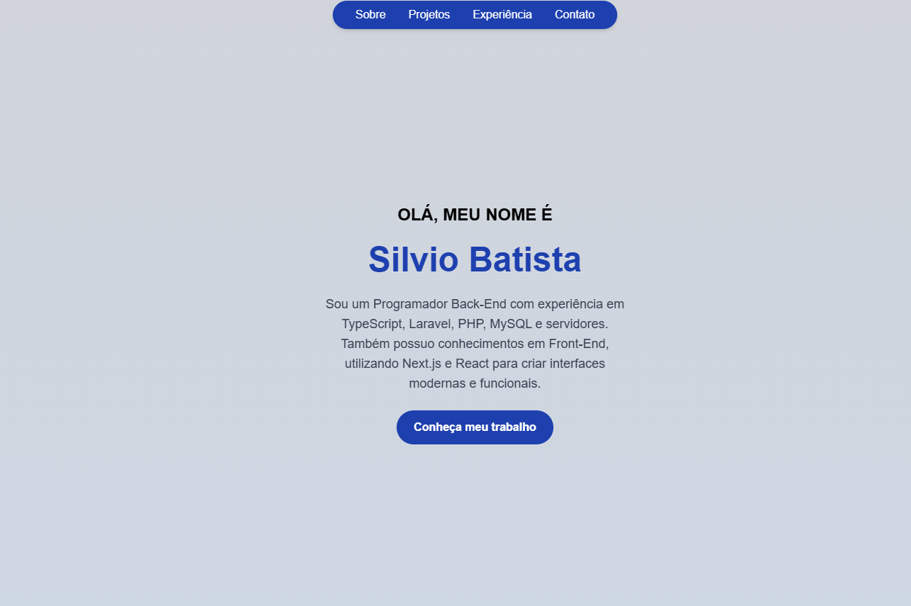

# Portfólio — Silvio Batista

Portfólio pessoal de **Silvio Batista**, desenvolvedor web full stack com foco em back-end. Site single-page construído com Next.js, com visual **dark dev aesthetic**, terminal animado, timeline de trajetória profissional e catálogo de projetos.



---

## Funcionalidades

- **Hero** — Apresentação com prompt de terminal e efeito typewriter
- **Sobre** — Bio, skills, stack tecnológica e experiência na Bredi
- **Terminal** — Demo animada com cenários rotativos (Laravel, Git, Docker, deploy)
- **Trajetória** — Timeline vertical com empregos, formação e projetos em destaque
- **Projetos** — Abas *Em destaque* e *Bredi*, com modal de detalhes e filtros por categoria
- **Formação** — Cards com logos das instituições (Unama, Multivix, EETEPA)
- **Contato** — WhatsApp e redes sociais
- **Tema claro/escuro** — Toggle com preferência salva no `localStorage`
- **Notificações dev** — Toasts divertidos estilo terminal (deploy, git, npm…)

---

## Tecnologias

| Camada | Stack |
|--------|-------|
| Framework | [Next.js 15](https://nextjs.org/) (App Router) |
| UI | React 18, TypeScript |
| Estilo | Tailwind CSS 3 |
| Animações | Framer Motion |
| Carrossel | Swiper 11 |
| Ícones | React Icons |
| Fontes | Orbitron, Exo 2, JetBrains Mono |

---

## Como rodar

**Pré-requisitos:** Node.js 18+

```bash
# Instalar dependências
npm install

# Desenvolvimento (Turbopack)
npm run dev

# Build de produção
npm run build

# Servir build local
npm run start

# Lint
npm run lint
```

Acesse [http://localhost:3000](http://localhost:3000) após `npm run dev`.

---

## Estrutura do projeto

```plaintext
portfolio-silvio/
├── public/
│   ├── icons/              # Ícones SVG das tecnologias
│   └── images/
│       ├── projects/       # Cases Bredi e logos dos projetos em destaque
│       └── ...             # Fotos, logos de empresas e instituições
├── src/
│   ├── app/                # Layout, página principal e estilos globais
│   ├── components/         # Componentes da interface
│   │   └── ui/             # Section, ProjectCard
│   ├── data/               # Conteúdo (projetos, timeline, educação, terminal)
│   ├── hooks/              # useTypewriter
│   └── types/              # Tipos TypeScript
├── package.json
└── tailwind.config.ts
```

### Onde editar conteúdo

| Arquivo | Conteúdo |
|---------|----------|
| `src/data/projects.ts` | Projetos em destaque e portfólio Bredi |
| `src/data/timeline.ts` | Trajetória profissional |
| `src/data/education.ts` | Formação acadêmica |
| `src/data/terminal.ts` | Cenários do terminal animado |
| `src/data/notifications.ts` | Mensagens dos toasts |

---

## Seções da página

| Ordem | Seção | ID |
|-------|-------|-----|
| 1 | Hero | — |
| 2 | Sobre | `about` |
| 3 | Terminal | `terminal` |
| 4 | Trajetória | `roadmap` |
| 5 | Projetos | `projects` |
| 6 | Formação | `education` |
| 7 | Contato | `contact` |

---

## Deploy

O projeto gera páginas estáticas e é compatível com [Vercel](https://vercel.com/), Netlify e hosts Node.js.

```bash
npm run build
```

Comando de build padrão: `next build`.

---

## Contato

- **GitHub:** [Silvio-Batista](https://github.com/Silvio-Batista)
- **LinkedIn:** [silvio-p-batista](https://www.linkedin.com/in/silvio-p-batista/)
- **WhatsApp:** (91) 99298-4421

---

Desenvolvido por **Silvio Batista** · Belém, PA
